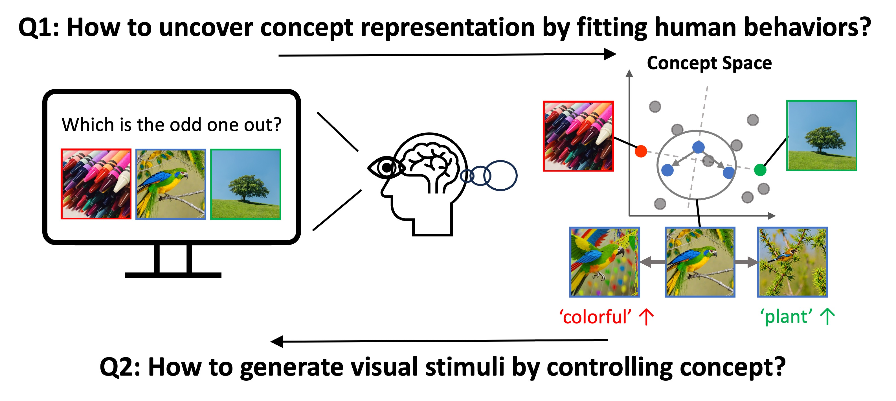
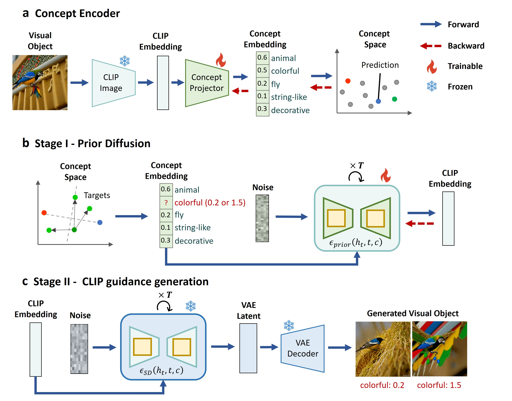
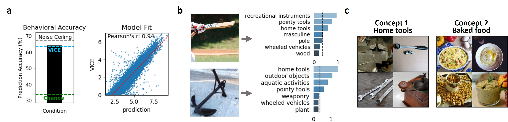
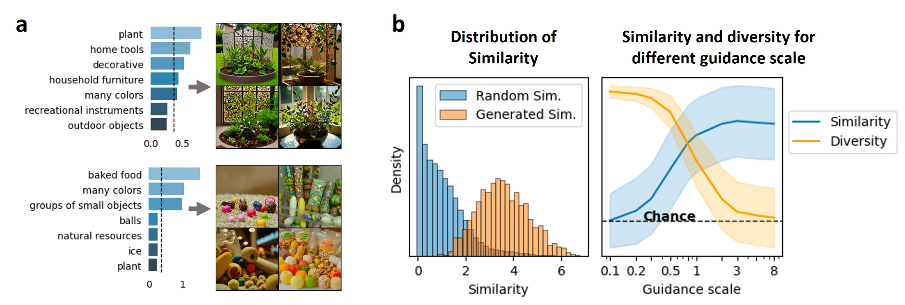
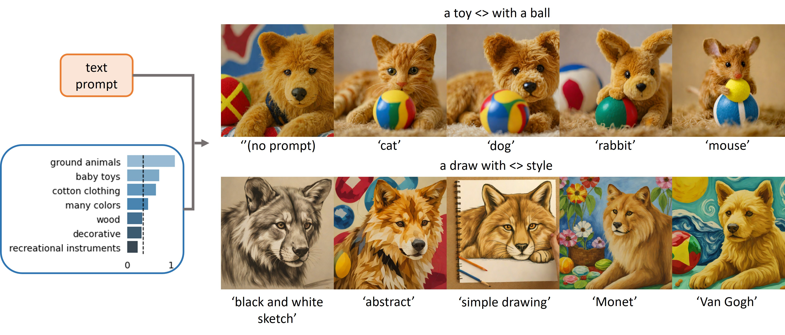
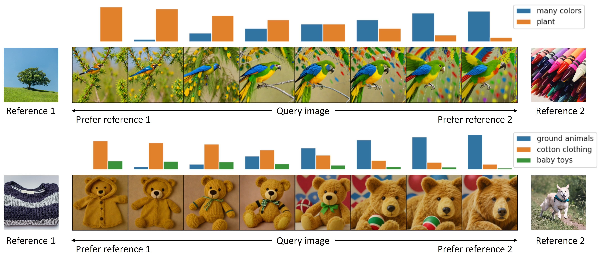

<div align="center">

<h2 style="border-bottom: 1px solid lightgray;">CoCoG: Controllable Visual Stimuli Generation based on Human Concept Representations</h2>

<!-- Badges and Links Section -->
<div style="display: flex; align-items: center; justify-content: center;">

<p align="center">
  <a href="#">
  <p align="center">
    <a href='https://arxiv.org/abs/2404.16482'></a>
  </p>
</p>

</div>

</div>



## Introduction

Understanding how humans process visual objects and uncover their low-dimensional concept representation from high-dimensional visual stimuli is crucial in cognitive science. The Concept based Controllable Generation (CoCoG) framework addresses this by:

- **Extracting Interpretable Concepts**: CoCoG includes an AI agent that efficiently predicts human decision-making in visual similarity tasks, offering insights into human concept representations.

- **Controllable Visual Stimuli Generation**: It employs a conditional generation model to produce visual stimuli based on extracted concepts, facilitating studies on causality in human cognition.

CoCoG's notable achievements are:
- **High Prediction Accuracy**: It outperforms current models in predicting human behavior in similarity judgment tasks.
- **Diverse Object Generation**: The framework can generate a wide range of objects controlled by concept manipulation.
- **Behavioral Manipulation Capability**: CoCoG demonstrates the ability to influence human decision-making through concept intervention.

## Method

**Concept Encoder for Embedding Low-Dimensional Concepts:**

- **Process**: Begins with training a concept encoder to map visual objects to concept embeddings. This involves using the CLIP image encoder to extract CLIP embeddings, then transforming these into concept embeddings via a learnable concept projector.
- **Training Task**: Utilizes the 'odd-one-out' similarity judgment task from the THINGS dataset, predicting human decisions based on the similarity between concept embeddings of visual objects.

**Two-Stage Concept Decoder for Controllable Visual Stimuli Generation:**

- **Stage I - Prior Diffusion**: Adopts a diffusion model conditioned on concept embeddings to approximate the distribution of CLIP embeddings, serving as the prior for the subsequent generation stage.
- **Stage II - CLIP Guided Generation**: Leverages pre-trained models to generate visual objects from CLIP embeddings, utilizing the concept embeddings as a guiding condition for the generation process.

<figure>
  
  <figcaption style="text-align: center; font-weight: bold;">Figure 1: The framework of CoCoG.</figcaption>
</figure>


## Results

### Model Validation

**Predicting and Explaining Human Behaviors:**
- **Accuracy**: Achieved 64.07% accuracy in predicting human behavior on the THINGS Odd-one-out dataset, surpassing the previous SOTA model.
- **Interpretability**: Demonstrated through the activation of concepts within visual objects, aligning with human intuition and providing clear explanations of visual object characteristics.

<figure>
  
  <figcaption style="text-align: center; font-weight: bold;">Figure 2: The performance of the concept encoder in predicting and explaining human behavior.</figcaption>
</figure>

**Generative Effectiveness of Concept Decoder:**
- **Consistency with Concept Embedding**: Generated visual objects are consistent with their concept embeddings, showcasing the model's ability to conditionally generate visuals aligned with specific concepts.
- **Control Over Diversity**: By adjusting the guidance scale, the model can balance the similarity and diversity of generated visual objects.

<figure>
  
  <figcaption style="text-align: center; font-weight: bold;">Figure 3: The performance of generated visual objects by controlling concept embeddings.</figcaption>
</figure>

### CoCoG for Counterfactual Explanations

**Flexible Control with Text Prompts:**
- Using the same concept embedding with different text prompts, CoCoG generates visual objects that retain the concept's characteristics, demonstrating its utility in exploring counterfactual questions.

<figure>
  
  <figcaption style="text-align: center; font-weight: bold;">Figure 4: Visual objects generated with the same concept embedding combined with different text prompts.</figcaption>
</figure>

<!-- This adds space between the figures -->
<div style="margin-top: 20px;"></div>

<figure>
  
  <figcaption style="text-align: center; font-weight: bold;">Figure 5: Visual objects generated with different concept embeddings combined with the same text prompt.</figcaption>
</figure>

**Manipulating Similarity Judgments:**
- CoCoG can directly influence human similarity judgment by intervening with key concepts, offering a powerful tool for analyzing the causal mechanisms of concepts in human cognition and decision-making processes.

<figure>
  
  <figcaption style="text-align: center; font-weight: bold;">Figure 7: Manipulating similarity judgment behavior by key concepts intervention.</figcaption>
</figure>

## Conclusion

The CoCoG model innovatively combines AI and cognitive science, enhancing our understanding and interaction with human cognition:

- **AI and Human Cognition**: Merges DNNs with human cognition, improving visual understanding and safety in AI-human interactions.

- **Cognitive Science Advancement**: Offers a novel approach for cognitive research, enabling the generation of diverse stimuli to study human behavior and cognitive mechanisms.

- **Future Directions**: Promises to align AI models with human cognition more closely and improve research efficiency through optimal experimental design.

## Code

### Get started
You can then set up a conda environment with all dependencies like so:
```
conda env create -f cocog.yml
conda activate cocog
```
### File structure
The code is organized as follows:

- ConceptDecoder.ipynb: concept-based image generation and decision intervention
- ConceptEncoder.ipynb: extract concept embedding
- dataset.py: load images
- diffusion_prior.py: diffusion model and pipeline to generate clip embedding from concept embedding
- networks.py: concept encoder model
- utils.py: utility functions for plotting